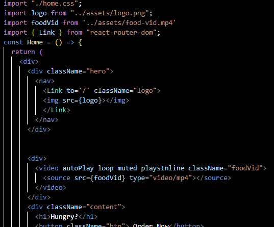
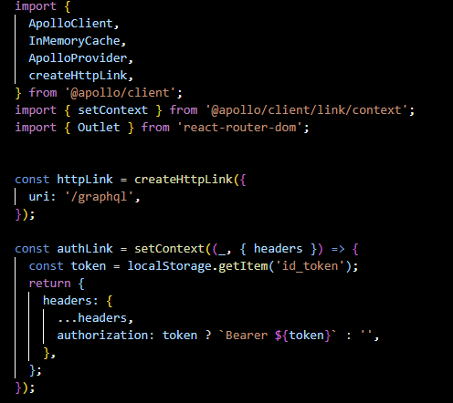
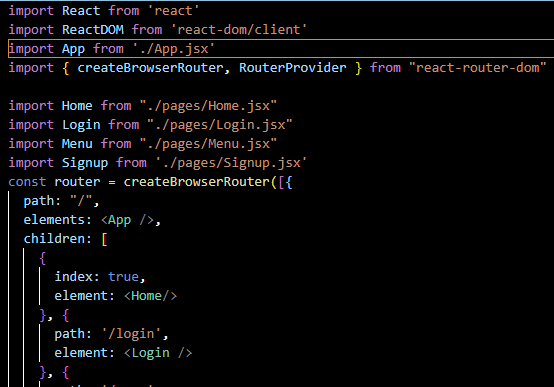

# Manny's Munchies

## Interactive MERN Stack Single-Page Application
## Table of Contents

- [Overview](#overview)
- [Requirements](#requirements)
- [Technologies Used](#technologies-used)
- [Features](#features)
- [Usage](#usage)
- [Code Overview](#code-overview)
- [Assets](#assets)
- [Video Demo](#video-demo)
- [Links](#links)
- [Contributors](#contributors)
- [License](#license)

### Overview

Manny Munchies is a collaborative effort aimed at creating a user-friendly MERN stack single-page application. The application allows users to sign in, view the menu, add or delete items, and place orders securely. It leverages React for the front end, GraphQL with Node.js and Express.js for the server, and MongoDB with Mongoose ODM for the database. User authentication is implemented using JWT for enhanced security.

### Requirements

- **Front End**: Use React for building the front end.
- **Back End**: Utilize GraphQL with a Node.js and Express.js server.
- **Database**: Employ MongoDB and the Mongoose ODM for the database.
- **CRUD Operations**: Use queries and mutations for retrieving, adding, updating, and deleting data.
- **Deployment**: Deploy the application using Render, ensuring real-world data availability.
- **UI**: Develop a polished and responsive UI.
- **Interactivity**: Implement interactive features to accept and respond to user input.
- **Authentication**: Include authentication using JWT for user security.
- **API Key Protection**: Protect sensitive API key information on the server.
- **Repository**: Maintain a clean repository adhering to quality coding standards.

### Technologies Used

- React
- GraphQL
- Node.js
- Express.js
- MongoDB
- Mongoose ODM
- JWT Authentication
- Render (for deployment)

### Features

- **User Authentication**: Secure sign-in functionality for users to access the ordering system.
- **Dynamic Menu**: Browse a dynamic menu of delicious food items available for order.
- **Order Management**: Add or delete food items from the menu and manage your selections.
- **Responsive UI**: Enjoy a polished and responsive user interface for seamless browsing on all devices.

### Usage

- Sign in to your Manny Munchies account using your credentials.
- Browse the menu to view available food items.
- Add items to your order by selecting from the menu.
- Remove items from your order if desired.
- Place your order securely.
- Enjoy your delicious meal delivered right to your doorstep!

### Code Overview

    Home Component

    

    App Component

    

    Router Configuration

    

### Assets

(screenshots of app)

### Video Demo

### Links

Render URL: https://full-stack-fusion.onrender.com/

### Contributors
- Ashley Paluzzi
- Elias Mendoza
- Walter Matulich
- Manny 

### License

This project is licensed under the MIT License.
